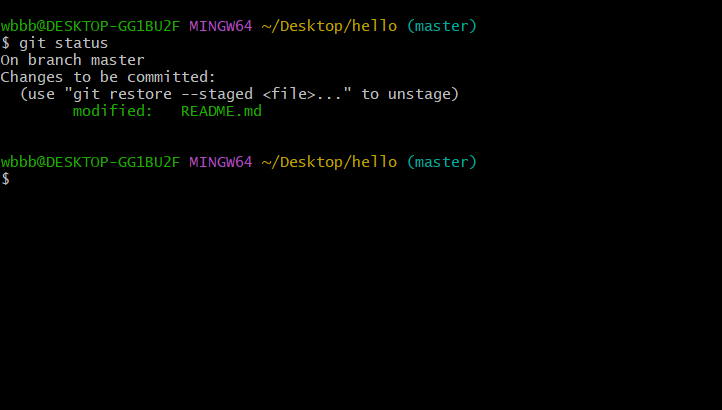

## git的介绍

git是一个版本控制软件，用于多人协作开发项目，可以结合github一起学习。  
git分为三个部分，工作区(WorkSpace)，暂存区(Staged)，仓库(Res).  
文件的状态分为四个:  
1,untracked状态:这种状态一般是文件刚刚新建出来,存在工作区,并未在仓库里有对应的文件.即未跟踪的状态。  
2,staged状态:在git里表示处于暂存区的文件,显示为绿色。虽然图片显示为modified，然而在git中应当为staged状态。  
  


```bash
wbbb@DESKTOP-GG1BU2F MINGW64 ~/Desktop/hello (master)
$ git status
On branch master
Changes to be committed:
  (use "git restore --staged <file>..." to unstage)
        modified:   README.md
```

3，modified状态：当前工作区的文件已被更改，和仓库文件不一致导致modified状态，表示在工作区已经修改文件，和仓库文件不一致。  
4，unmodified状态：这种状态表示当前工作区的文件和仓库文件完全一致，没有作任何修改，在commit之后的文件一定处于unmodified状态。

## git 的常见命令及其使用

> - `git init` 创建一个文件夹之后输入这个命令可以初始化为一个仓库，并生成.git文件。
> - `git add <文件名>` 表示提交某个文件到暂存区。一般使用git add .来将整个文件夹里的文件都提交到暂存区。
> - `git commit -m "message"` 表示提交暂存区的文件到仓库，-m表示message，表示提交的描述。
> - `git status` 查看文件的状态，查看哪些文件处于暂存区，即staged状态(绿色)哪些文件处于还没有提交的modified状态(红色)。  
> - `git reset` <文件哈希值> 表示回退到某个版本，回退到某一次提交的状态。如果不写参数，则默认使用git reset -mixed参数。  
> - `git reset --mixed` 表示回退时保留当前工作区所有的更改，但不进入暂存区，也不提交，只是保证了在工作区的文件的修改不丢失，可以自行选择要不要commit。(推荐使用)  
> - `git reset --soft` 表示当前在工作区的修改进入staged状态，相当于自动执行了一个git add .  
> - `git reset --hard` 表示当前在工作区的修改全部不保存，执行这个指令时当前工作区的文件完全变为回退到的版本的文件的状态。(不推荐使用)  
> - `git log` 查看提交日志,但不记录  
> - `git reflog` 查看所有的提交日志，包括回退版本这个动作的记录。
