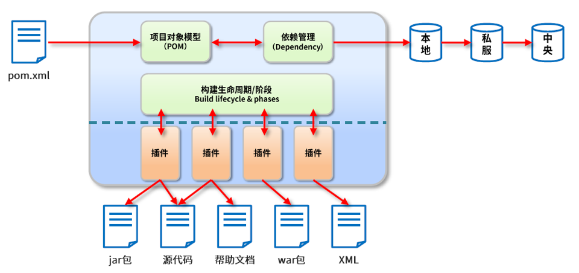
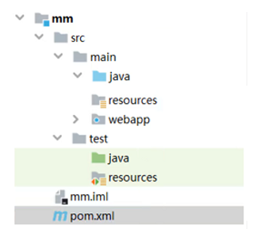
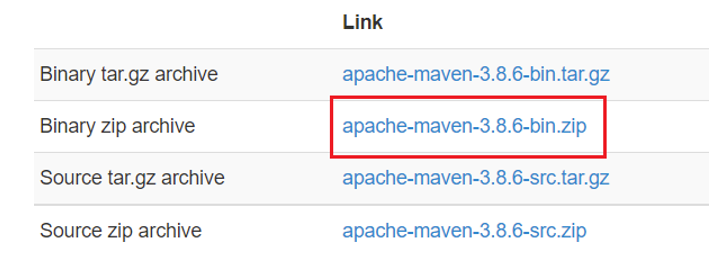
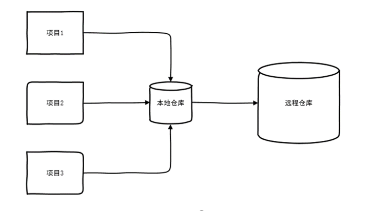
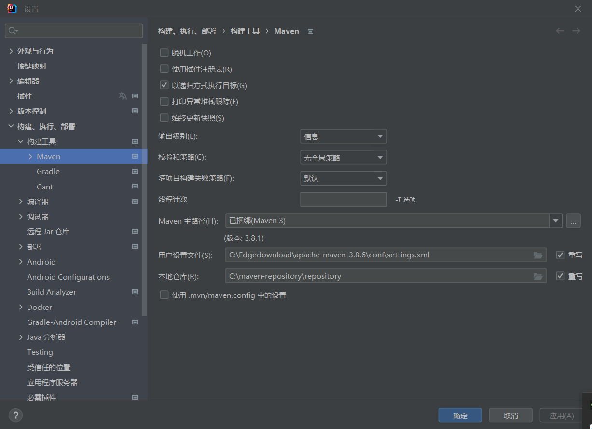
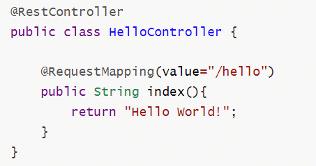
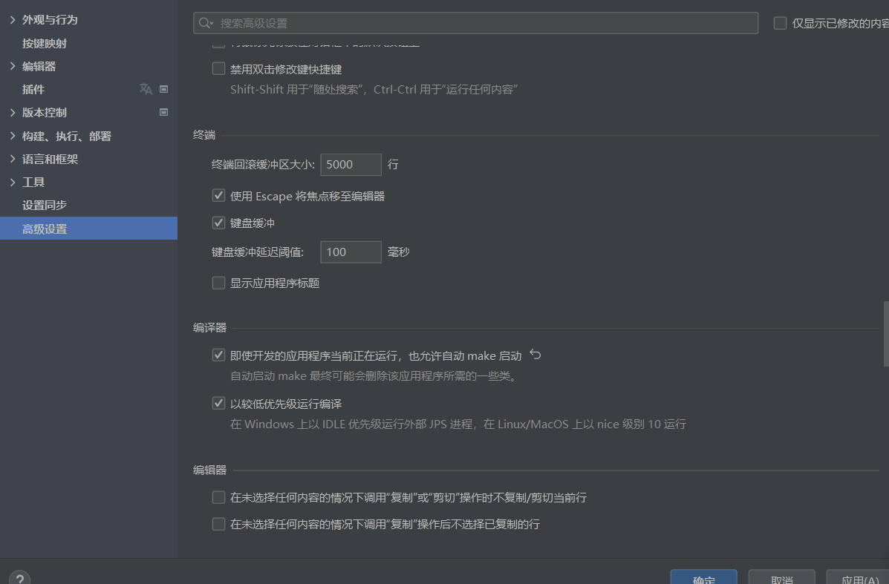

## spring boot教程

## 环境

jdk 8及以上版本，Maven，idea专业版，以及其他依赖。  

## Maven

Maven 是一个项目管理工具，可以对 Java 项目进行自动化的构建和依赖管理。


## Maven的作用

### Maven的作用可以分成三类。  

- 项目构建：提供标准的，跨平台的自动化构建项目的方式。
- 依赖管理：方便快捷的管理项目依赖的资源（jar包），避免资源间的版本冲突等问题。
- 统一开发结构：提供标准的，统一的项目开发结构，如下图所示。


## Maven环境配置

- 官方下载地址：http://maven.apache.org/download.cgi。


## Maven仓库

- 运行 Maven 的时候，Maven 所需要的任何构件都是直接从本地仓库获取的。如果本地仓库没有，它会首先尝试从远程仓库下载构件至本地仓库。


## 本地仓库配置

- 修改maven安装包中的conf/settings.xml文件，指定本地仓库位置。
- 后面maven会将jar包自动下载到指定的仓库位置，如果不配置默认存在用户目录下，即${user.home}/.m2/repository下  

```xml
<!-- localRepository
  | The path to the local repository maven will use to store artifacts.  
  |  
  | Default: ${user.home}/.m2/repository  
 <localRepository>/path/to/local/repo</localRepository>  
-->  
<localRepository>D:\maven-repository</localRepository>
```

## 远程仓库配置

maven默认连接的远程仓库位置并不在国内，因此有时候下载速度非常慢，我们可以配置一个国内站点镜像，可用于加速下载资源。  

```xml
<mirrors>
    <mirror>
        <id>aliyunmaven</id>
        <mirrorOf>*</mirrorOf>
        <name>阿里云公共仓库</name>
        <url>https://maven.aliyun.com/repository/public</url>
        </mirror>
<mirrors>        
```

## 配置用户设置文件和本地仓库所在位置

设置文件存在于下载apache-maven的文件里。本地仓库在新建maven项目后产生。可以重写这两个路径，需要自己动文件夹。


## spring boot快速上手

- 第一节 SpringBoot介绍
- 第二节 快速创建SpringBoot应用
- 第三节 开发环境热部署
- 第四节 系统配置

## SpringBoot介绍

- Spring Boot是由Pivotal团队提供的基于Spring的全新框架，旨在简化Spring应用的初始搭建和开发过程。
- Spring Boot是所有基于Spring开发项目的起点。
- Spring Boot就是尽可能地简化应用开发的门槛，让应用开发、测试、部署变得更加简单。

## SpringBoot特点

- 遵循“约定优于配置”的原则，只需要很少的配置或使用默认的配置。
- 能够使用内嵌的Tomcat、Jetty服务器，不需要部署war文件。
- 提供定制化的启动器Starters，简化Maven配置，开箱即用。
- 纯Java配置，没有代码生成，也不需要XML配置。
- 提供了生产级的服务监控方案，如安全监控、应用监控、健康检测等。

## 快速创建SpringBoot应用

- 利用IDEA提供的Spring Initializr创建SpringBoot应用

## 第一个helloworld程序

- 在com.example.helloworld下创建子目录controller
- 在目录controller中，创建HelloController.java文件
- 启动项目，在浏览器窗口中输入“<http://localhost:8080/hello>”


## 开发环境热部署

- 在实际的项目开发调试过程中会频繁地修改后台类文件，导致需要重新编译、重新启动，整个过程非常麻烦，影响开发效率。
- Spring Boot提供了spring-boot-devtools组件，使得无须手动重启Spring Boot应用即可重新编译、启动项目，大大缩短编译启动的时间。
- devtools会监听classpath下的文件变动，触发Restart类加载器重新加载该类，从而实现类文件和属性文件的热部署。
- 并不是所有的更改都需要重启应用（如静态资源、视图模板），可以通过设置spring.devtools.restart.exclude属性来指定一些文件或目录的修改不用重启应用

- 在pom.xml配置文件中添加dev-tools依赖。
- 使用optional=true表示依赖不会传递，即该项目依赖devtools；其他项目如果引入此项目生成的JAR包，则不会包含devtools

```xml
<dependency>
    <groupId>org.springframework.boot</groupId>
    <artifactId>spring-boot-devtools</artifactId>
    <optional>true</optional>
</dependency>
```

## 在application.properties中配置devtools

```xml
# 热部署生效
spring.devtools.restart.enabled=true
# 设置重启目录
spring.devtools.restart.additional-paths=src/main/java
# 设置classpath下的WEB-IFO文件夹内容修改不重启
spring.devtools.restart.exclude=static/**
```

- 如果使用了Eclipse，那么在修改完代码并保存之后，项目将自动编译并触发重启，而如果使用了IntelliJ IDEA，还需要配置项目自动编译。
- 打开Settings页面，在左边的菜单栏依次找到Build,Execution,Deployment→Compile，勾选Build project automatically
- 按Ctrl+Shift+Alt+/快捷键调出Maintenance页面，单击Registry，勾选compiler.automake.allow.when.app.running复选框。(2021之后要去高级设置里面勾选允许自动make启动)。


- 做完这两步配置之后，若开发者再次在IntelliJ IDEA中修改代码，则项目会自动重启。


