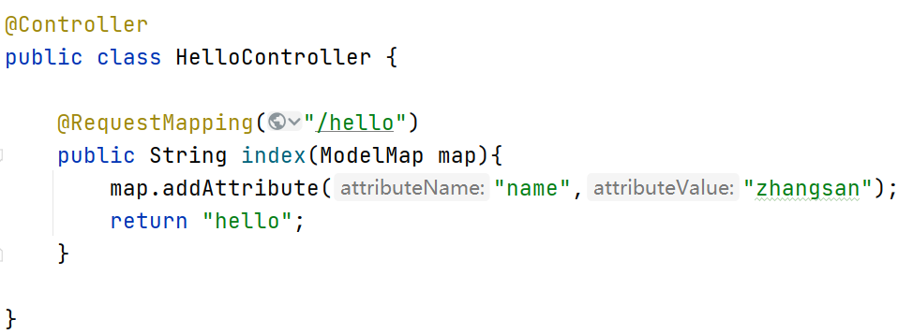
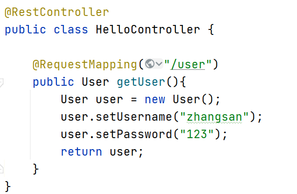
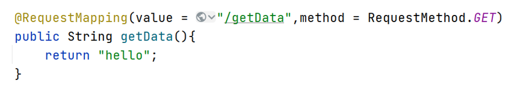

## Web开发基础

## Web入门

- Spring Boot将传统Web开发的mvc、json、tomcat等框架整合，提供了spring-boot-starter-web组件，简化了Web应用配置。
- 创建SpringBoot项目勾选Spring Web选项后，会自动将spring-boot-starter-web组件加入到项目中。
- spring-boot-starter-web启动器主要包括web、webmvc、json、tomcat等基础依赖组件，作用是提供Web开发场景所需的所有底层依赖。
- webmvc为Web开发的基础框架，json为JSON数据解析组件，tomcat为自带的容器依赖。

## 控制器

- Spring Boot提供了@Controller和@RestController两种注解来标识此类负责接收和处理HTTP请求。
- 如果请求的是页面和数据，使用@Controller注解即可；如果只是请求数据，则可以使用@RestController注解


## @Controller的用法

- 示例中返回了hello页面和name的数据，在前端页面中可以通过${name}参数获取后台返回的数据并显示。
- @Controller通常与Thymeleaf模板引擎结合使用。


## @RestController的用法

- 默认情况下，@RestController注解会将返回的对象数据转换为JSON格式。


## 路由映射

- @RequestMapping注解主要负责URL的路由映射。它可以添加在Controller类或者具体的方法上。
- 如果添加在Controller类上，则这个Controller中的所有路由映射都将会加上此映射规则，如果添加在方法上，则只对当前方法生效。
- @RequestMapping注解包含很多属性参数来定义HTTP的请求映射规则。常用的属性参数如下：
- value: 请求URL的路径，支持URL模板、正则表达式
- method: HTTP请求方法
- consumes: 请求的媒体类型（Content-Type），如application/json
- produces: 响应的媒体类型
- params，headers: 请求的参数及请求头的值
- @RequestMapping的value属性用于匹配URL映射，value支持简单表达式
      @RequestMapping("/user")
- @RequestMapping支持使用通配符匹配URL，用于统一映射某些URL规则类似的请求： @RequestMapping("/getJson/*.json")，当在浏览器中请求/getJson/a.json或者/getJson/b.json时都会匹配到后台的Json方法
- @RequestMapping的通配符匹配非常简单实用，支持“*”“?”“**”等通配符
符号“*”匹配任意字符，符号“**”匹配任意路径，符号“?”匹配单个字符。
- 有通配符的优先级低于没有通配符的，比如/user/add.json比/user/*.json优先匹配。
- 有“**”通配符的优先级低于有“*”通配符的。

## Method匹配

- HTTP请求Method有GET、POST、PUT、DELETE等方式。HTTP支持的全部Method
- @RequestMapping注解提供了method参数指定请求的Method类型，包括RequestMethod.GET、RequestMethod.POST、RequestMethod.DELETE、RequestMethod.PUT等值，分别对应HTTP请求的Method

- Method匹配也可以使用@GetMapping、@PostMapping等注解代替。

## 参数传递

- @RequestParam将请求参数绑定到控制器的方法参数上，接收的参数来自HTTP请求体或请求url的QueryString，当请求的参数名称与Controller的业务方法参数名称一致时,@RequestParam可以省略
- @PathVaraible：用来处理动态的URL，URL的值可以作为控制器中处理方法的参数
- @RequestBody接收的参数是来自requestBody中，即请求体。一般用于处理非 Content-Type: application/x-www-form-urlencoded编码格式的数据，比如：`application/json`、`application/xml`等类型的数据

## ORM介绍

- ORM（Object Relational Mapping，对象关系映射）是为了解决面向对象与关系数据库存在的互不匹配现象的一种技术。
- ORM通过使用描述对象和数据库之间映射的元数据将程序中的对象自动持久化到关系数据库中。
- ORM框架的本质是简化编程中操作数据库的编码。

## MyBatis-Plus介绍

- MyBatis是一款优秀的数据持久层ORM框架，被广泛地应用于应用系统。
- MyBatis能够非常灵活地实现动态SQL，可以使用XML或注解来配置和映射原生信息，能够轻松地将Java的POJO（Plain Ordinary Java Object，普通的Java对象）与数据库中的表和字段进行映射关联。
- MyBatis-Plus是一个 MyBatis 的增强工具，在 MyBatis 的基础上做了增强，简化了开发。

## 添加依赖

在pom.xml中添加

```xml
<!--  MyBatisPlus依赖  -->
<dependency>
    <groupId>com.baomidou</groupId>
    <artifactId>mybatis-plus-boot-starter</artifactId>
    <version>3.4.2</version>
</dependency>
<!--  mysql驱动依赖  --> 
<dependency>   
    <groupId>mysql</groupId>
    <artifactId>mysql-connector-java</artifactId>
    <version>5.1.47</version>
</dependency>
<!--  数据连接池 druid  --> 
<dependency>   
    <groupId>com.alibaba</groupId>
    <artifactId>druid-spring-boot-starter</artifactId>
    <version>1.1.20</version>
</dependency>
```

依赖版本可以自己更新

## 全局配置
